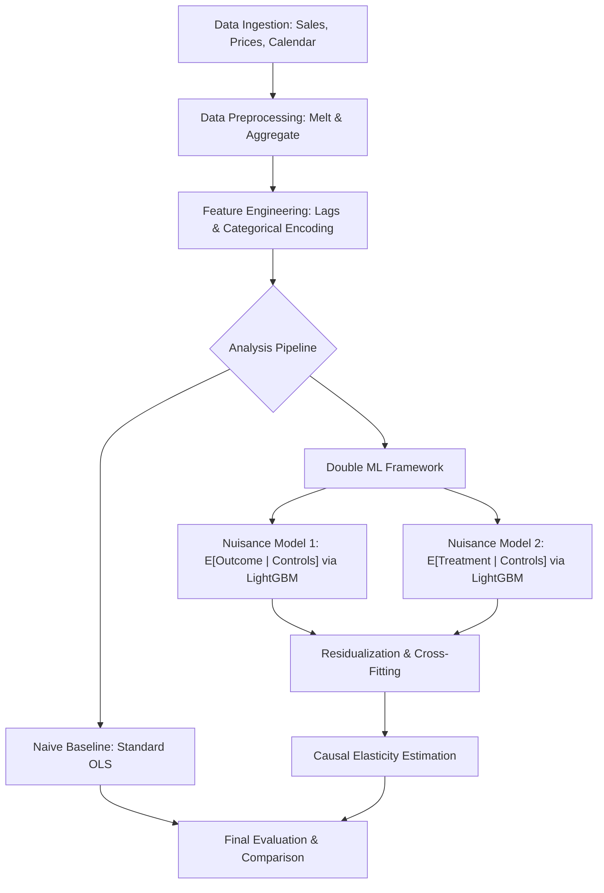

# Double Machine Learning for Demand Price Elasticity

This repository is intended to provide a baseline for hands-on practice with causal inference techniques, specifically focusing on estimating demand price elasticity using Double Machine Learning (DML). 

The project utilizes a structured pipeline to process M5 Walmart retail goods sales data (https://www.kaggle.com/competitions/m5-forecasting-accuracy/data), engineer relevant features, and apply the Partially Linear Regression (PLR) DML model to obtain unbiased estimates of price elasticity.

## Process Flow



## Project Overview

In retail analytics, estimating the effect of price on quantity sold is often confounded by seasonality, promotions, and historical trends. Standard OLS regressions often suffer from "omitted variable bias" or "overfitting" when dealing with high-dimensional controls.

## ML Model vs. OLS Discussion

### Ordinary Least Squares (OLS)
Traditional OLS serves as our naive baseline. While computationally efficient and interpretable, it assumes a strictly linear relationship between all variables. In retail data, price changes are often correlated with unobserved factors (like marketing campaigns) or non-linear seasonal trends. If these confounders are not perfectly captured and linearly specified, the OLS estimate of elasticity will be biased and potentially misleading.

### Double Machine Learning (DML) with LightGBM
This project uses **Double Machine Learning** to overcome the limitations of OLS. The core innovation is the use of various high-performance ML models to handle the "nuisance" part of the estimation.

1.  **Flexibility**: High-capacity learners like **LightGBM**, **XGBoost**, and **XGBRF** (XGBoost's Random Forest implementation) are chosen for their ability to capture complex, non-linear interactions and dependencies between features (e.g., how the impact of a SNAP event changes depending on the month) that standard linear models often miss.
2.  **Orthogonalization**: By using ML to predict both the quantity ($Y$) and the price ($T$) based on the controls, and then regressing the residuals, DML "partials out" the influence of confounders. This ensures that the final elasticity estimate is derived only from the variation in price that is *not* explained by other factors.
3.  **Cross-Fitting**: DML employs K-fold cross-fitting to remove bias introduced by overfitting the ML models, a common pitfall when using flexible learners for causal inference.

### Choice of Nuisance Learners
The repository compares three distinct learners for the nuisance functions, chosen for their performance characteristics and ability to handle complex data:
*   **LightGBM**: Known for its speed and efficiency, especially on large datasets, and its ability to handle categorical features effectively. It's a gradient boosting framework that uses tree-based learning algorithms.
*   **XGBoost**: A highly robust and widely used gradient boosting framework that provides strong regularization to prevent overfitting. It's known for its high performance and flexibility.
*   **XGBRF (XGBoost Random Forest)**: This is XGBoost's implementation of Random Forest. It's effective at capturing high-order interactions and non-linear relationships without the sequential dependencies of gradient boosting, offering a different ensemble approach.

### Hardware Acceleration (Apple Silicon)
This implementation is configured for **Apple Silicon (M1/M2/M3)**:
*   **XGBoost & XGBRF**: Currently configured for highly parallelized CPU execution. 
    > **Note**: While XGBoost supports `mps` (Metal Performance Shaders) for GPU acceleration on Apple Silicon, your current installation does not seem to have it enabled. To use `mps`, you might need to install a specific build of XGBoost (e.g., from source or a pre-built wheel with MPS support).
*   **LightGBM**: Currently configured for highly parallelized CPU execution. 
    > **Note**: To enable LightGBM GPU on M3, you must recompile the library with OpenCL support (`brew install cmake libomp` and follow build instructions).

### Multi-Model Comparison
The repository compares three distinct learners for the nuisance functions:
*   **LightGBM**: Optimized for speed and large datasets.
*   **XGBoost**: Highly robust with strong regularization to prevent over-fitting.
*   **Random Forest**: Effective at capturing high-order interactions without sequential dependencies.

## Repository Structure

*   `main.py`: The entry point that orchestrates the data loading, feature engineering, and model training phases.
*   `data_preparation.py`: Handles the ingestion of sales, prices, and calendar data. It performs log-transformations and aggregates data to a weekly granularity.
*   `feature_engineering.py`: Creates lagged sales features (crucial for capturing demand momentum) and encodes categorical variables for the ML learners.
*   `model_training.py`: Defines the DoubleML data structure and executes the `DoubleMLPLR` using LightGBM as the nuisance learners.
*   `config.py`: A centralized configuration file for hyperparameters, column mappings, and file paths.
*   `evaluation.py`: (Utility) Contains functions to compare DML results against a baseline OLS model.

## Data Requirements

The pipeline expects three CSV files in a `data/` directory:
1.  `sales_train_evaluation.csv`: Unit sales per item/store.
2.  `sell_prices.csv`: Weekly prices per item/store.
3.  `calendar.csv`: Mapping dates to weeks, months, and event flags (e.g., SNAP, holidays).

## Getting Started

### 1. Prerequisites
Ensure you have Python 3.8+ installed. It is recommended to use a virtual environment:

```bash
python -m venv venv
source venv/bin/activate  # On Windows: venv\Scripts\activate
pip install pandas numpy doubleml lightgbm xgboost scikit-learn
```

### 2. Configuration
Modify `config.py` to change the target category (default: `FOODS`) or adjust the LightGBM hyperparameters to suit your dataset size.

### 3. Execution
Run the full pipeline with:

```bash
python3 main.py
```

## Technical Methodology

The model solves the following system:
1.  $Y = g_0(X, W) + \theta D + \zeta$
2.  $D = m_0(X, W) + \nu$

Where:
*   **$Y$ (Outcome)**: `log_quantity` (Log-transformed sales)
*   **$D$ (Treatment)**: `log_price` (Log-transformed unit price)
*   **$X$ (Effect Modifiers)**: Fixed effects like `store_id` and `dept_id`.
*   **$W$ (Controls)**: Confounders including seasonality (`month`), promotional events, and historical demand (`lag_sales`).
*   **$\theta$**: The coefficient of interest, representing the **Price Elasticity of Demand**.

## Key Features

*   **Automated Preprocessing**: Handles the "melt" and "merge" operations for complex relational retail data.
*   **Leakage Prevention**: Uses K-fold cross-fitting via the `doubleml` library to prevent overfitting in the nuisance models.
*   **Elasticity Interpretation**: Since both price and quantity are log-transformed, the resulting coefficient is directly interpretable as elasticity (a 1% change in price leads to a $\theta$% change in quantity).

## Results and Discussion

This section presents the estimated price elasticities from both the naive OLS baseline and the Double Machine Learning models, along with a brief interpretation.

### Naive OLS Results
The Ordinary Least Squares (OLS) model provides a baseline estimate of the price elasticity by directly regressing `log_quantity` on `log_price`.

```
--- Naive OLS Results ---
==============================================================================
                 coef    std err          t      P>|t|      [0.025      0.975]
------------------------------------------------------------------------------
const          1.2671      0.001   2261.176      0.000       1.266       1.268
log_price     -0.3746      0.000   -783.475      0.000      -0.376      -0.374
==============================================================================
```

The OLS estimate for `log_price` is **-0.3746**. This suggests that a 1% increase in price leads to a 0.3746% decrease in quantity sold. While statistically significant (p-value 0.000), this estimate is likely biased due to unaddressed confounding factors (e.g., seasonality, promotions, historical demand) that simultaneously influence both price and quantity. OLS struggles to isolate the true causal effect in such complex scenarios.

### Double Machine Learning (DML) Results
The DML framework, using various machine learning models as nuisance learners, provides more robust and less biased estimates of price elasticity by effectively controlling for high-dimensional confounders.

```
--- DML Model Comparison (Learner Robustness) ---
Learner         | Elasticity | Std Error  | t-stat     | p-val     
-----------------------------------------------------------------
lightgbm        | -0.0927    | 0.0004     | -224.4966  | 0.0000    
xgboost         | -0.0940    | 0.0004     | -225.9129  | 0.0000    
random_forest   | -0.0988    | 0.0004     | -234.4056  | 0.0000    
```

**Interpretation and Comparison:**

The DML estimates for price elasticity are significantly different from the OLS estimate, and notably more consistent across the different nuisance learners:
*   **LightGBM**: -0.0927
*   **XGBoost**: -0.0940
*   **XGBRF (Random Forest)**: -0.0988

All DML estimates are negative, indicating that demand is indeed elastic (as expected for most goods), but the magnitude is much smaller than the OLS estimate. This suggests that the naive OLS model likely overestimated the price sensitivity, possibly by attributing the effect of other correlated factors (like promotions or seasonal demand shifts) to price changes.

### Practical Interpretation of Effect Size

The DML models converged on a price elasticity of approximately **-0.09**. In practical business terms, this means:
*   **Inelastic Demand**: A 10% increase in price is associated with only a **0.9% decrease** in quantity sold. 
*   **Pricing Power**: For the "FOODS" category, the consumer demand is relatively unresponsive to price changes. This suggests that the brand or category holds significant pricing power; price increases are likely to lead to an overall increase in total revenue because the margin gain per unit significantly outweighs the minor volume loss.
*   **Strategic Action**: Marketing efforts should likely focus more on volume-driving activities (cross-selling, availability) rather than deep discounting, as the volume "lift" from a 10% discount would only be 0.9%, likely failing to cover the cost of the promotion.

### Robustness & Advanced Analysis

To move beyond the global average and ensure statistical reliability, this repository includes specialized scripts:
1.  **Standard Error Stability**: Run `python3 stability_analysis.py` to verify if the -0.09 estimate remains stable across different data sub-samples (reducing concerns about high variance).
2.  **Heterogeneity Analysis**: Run `python3 heterogeneity_analysis.py` to decompose the global elasticity. This explores whether specific segments (e.g., certain stores or departments) are more or less price-sensitive than the -0.09 average.

The consistency of the elasticity estimates across LightGBM, XGBoost, and XGBRF (ranging from -0.0927 to -0.0988) is a strong indicator of the robustness of the causal finding. Despite using different underlying machine learning architectures for the nuisance functions, the final causal parameter remains stable. This stability increases confidence that the DML models have successfully isolated the true causal effect of price on demand, after accounting for complex confounding. The very low standard errors and p-values (0.0000) further confirm the statistical significance of these estimates.

In conclusion, the DML approach provides a more credible and less biased estimate of price elasticity (around -0.09 to -0.10) compared to the naive OLS model (-0.3746), highlighting the importance of advanced causal inference techniques in retail analytics.

## Standard Error Stability Analysis

### Importance and Thought Process
When working with massive datasets (over 11 million rows), statistical significance is easily achieved ($p$-values often hit zero). However, statistical significance does not always guarantee **robustness**. A key question is whether the estimated elasticity is stable across different subsets of the data or if it is being driven by specific outliers or temporal anomalies.

Standard Error Stability Analysis is required to:
- **Validate Reliability**: Ensure that the -0.09 estimate is a consistent property of the data, not a "lucky" result of the full sample.
- **Assess Variance**: Determine how much the coefficient "swings" when the sample changes.
- **Build Confidence**: Provide stakeholders with evidence that the pricing strategy is based on a stable consumer behavior pattern.

### Methodology
The stability is assessed using the `stability_analysis.py` script, which performs a sub-sampling routine:
1. **Random Sampling**: The script extracts 5 independent random sub-samples of 1,000,000 rows each from the master dataset.
2. **DML Execution**: For each sub-sample, a full Double Machine Learning (DML) pipeline is executed using the LightGBM nuisance learner.
3. **Statistical Aggregation**: We track the movement of the elasticity coefficient ($\theta$) and its standard error (SE) across iterations to calculate the mean, standard deviation, and maximum deviation.

### Results and Discussion
The analysis yielded the following results across 5 iterations:

| Iteration | Elasticity ($\theta$) | Std Error |
| :--- | :--- | :--- |
| 1 | -0.0909 | 0.0014 |
| 2 | -0.0945 | 0.0014 |
| 3 | -0.0927 | 0.0014 |
| 4 | -0.0938 | 0.0014 |
| 5 | -0.0947 | 0.0014 |

**Summary Statistics:**
- **Mean Coefficient**: -0.0933
- **Coefficient Std Dev**: 0.0014
- **Max Deviation**: 0.0038

**Interpretation:**
The analysis reveals **High Stability**. The coefficient standard deviation (0.0014) is extremely small relative to the mean (-0.0933), and the maximum deviation across iterations is less than 0.004. This confirms that the estimated price elasticity is remarkably robust to data sampling. Whether we look at the full 11 million rows or a random subset of 1 million, the consumer sensitivity remains anchored around the -0.09 mark, providing high confidence for pricing interventions.

## Heterogeneity Analysis

### Importance and Thought Process
While a global elasticity estimate (approx. -0.09) provides a high-level overview of consumer behavior, it assumes that all consumers in all locations respond identically to price changes. In reality, factors like local competition, regional demographics, and store-specific demand patterns create variation. 

Identifying this **Heterogeneity** (Treatment Effect Variation) is critical for:
- **Localized Pricing**: Adjusting prices at the store level to maximize revenue based on local sensitivity.
- **Inventory Management**: Predicting demand shifts more accurately for specific regions.
- **Strategic Resource Allocation**: Focusing promotional budgets on segments that show higher responsiveness.

### Methodology
To analyze this variation, we execute a segmentation-based DML approach using the `heterogeneity_analysis.py` script. The dataset is partitioned into subsets based on a specific attribute (defined in `config.py` as `HETERO_SEGMENT_COL`, currently `store_id`). For each segment, the pipeline runs an independent `DoubleMLPLR` model using the LightGBM learner to calculate a segment-specific elasticity coefficient ($\theta_{segment}$).

### Results and Interpretation
The following table summarizes the elasticity across different store segments:

| Segment (Store) | Elasticity | Std Error | p-val |
| :--- | :--- | :--- | :--- |
| 7 | -0.1312 | 0.0013 | 0.0 |
| 8 | -0.1104 | 0.0015 | 0.0 |
| 9 | -0.1040 | 0.0013 | 0.0 |
| 0 | -0.0972 | 0.0013 | 0.0 |
| 3 | -0.0922 | 0.0012 | 0.0 |
| 1 | -0.0906 | 0.0014 | 0.0 |
| 2 | -0.0894 | 0.0014 | 0.0 |
| 4 | -0.0788 | 0.0012 | 0.0 |
| 5 | -0.0777 | 0.0013 | 0.0 |
| 6 | -0.0673 | 0.0012 | 0.0 |

**Spread:** Min -0.1312 to Max -0.0673

**Key Findings:**
- **Significant Variance**: The elasticity ranges from **-0.0673 to -0.1312**. This "spread" confirms that demand in Store 7 is nearly **twice as sensitive** to price changes as demand in Store 6.
- **Robust Significance**: All segments maintain a p-value of 0.0, indicating that even when the data is sliced into smaller store-level cohorts, the evidence for the estimated elasticity remains overwhelming.
- **Strategic Insight**: A blanket price increase across all stores would disproportionately impact sales in Store 7. Conversely, Store 6 could likely tolerate higher price increases with minimal impact on volume compared to the global average. This granular view allows for a "surgical" approach to revenue management.

## License
This project is licensed under the MIT License.