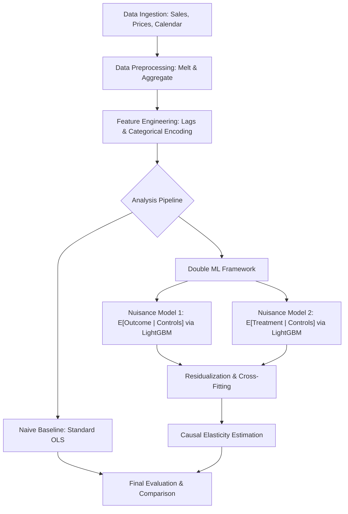

# Double Machine Learning for Demand Price Elasticity

This repository is intended to provide a baseline for hands-on practice with causal inference techniques, specifically focusing on estimating demand price elasticity using Double Machine Learning (DML). 

The project utilizes a structured pipeline to process retail data (inspired by the M5 Forecasting competition format), engineer relevant features, and apply the Partially Linear Regression (PLR) DML model to obtain unbiased estimates of price elasticity.

## Process Flow



## Project Overview

In retail analytics, estimating the effect of price on quantity sold is often confounded by seasonality, promotions, and historical trends. Standard OLS regressions often suffer from "omitted variable bias" or "overfitting" when dealing with high-dimensional controls.

## ML Model vs. OLS Discussion

### Ordinary Least Squares (OLS)
Traditional OLS serves as our naive baseline. While computationally efficient and interpretable, it assumes a strictly linear relationship between all variables. In retail data, price changes are often correlated with unobserved factors (like marketing campaigns) or non-linear seasonal trends. If these confounders are not perfectly captured and linearly specified, the OLS estimate of elasticity will be biased and potentially misleading.

### Double Machine Learning (DML) with LightGBM
This project leverages **Double Machine Learning** to overcome the limitations of OLS. The core innovation is the use of high-performance ML models—specifically **LightGBM**—to handle the "nuisance" part of the estimation.

1.  **Flexibility**: LightGBM captures complex, non-linear interactions and dependencies between features (e.g., how the impact of a SNAP event changes depending on the month) that would be impossible to specify manually in a linear model.
2.  **Orthogonalization**: By using ML to predict both the quantity ($Y$) and the price ($T$) based on the controls, and then regressing the residuals, DML "partials out" the influence of confounders. This ensures that the final elasticity estimate is derived only from the variation in price that is *not* explained by other factors.
3.  **Cross-Fitting**: DML employs K-fold cross-fitting to remove bias introduced by overfitting the ML models, a common pitfall when using flexible learners for causal inference.

## Repository Structure

*   `main.py`: The entry point that orchestrates the data loading, feature engineering, and model training phases.
*   `data_preparation.py`: Handles the ingestion of sales, prices, and calendar data. It performs log-transformations and aggregates data to a weekly granularity.
*   `feature_engineering.py`: Creates lagged sales features (crucial for capturing demand momentum) and encodes categorical variables for the ML learners.
*   `model_training.py`: Defines the DoubleML data structure and executes the `DoubleMLPLR` using LightGBM as the nuisance learners.
*   `config.py`: A centralized configuration file for hyperparameters, column mappings, and file paths.
*   `evaluation.py`: (Utility) Contains functions to compare DML results against a baseline OLS model.

## Data Requirements

The pipeline expects three CSV files in a `data/` directory:
1.  `sales_train_evaluation.csv`: Unit sales per item/store.
2.  `sell_prices.csv`: Weekly prices per item/store.
3.  `calendar.csv`: Mapping dates to weeks, months, and event flags (e.g., SNAP, holidays).

## Getting Started

### 1. Prerequisites
Ensure you have Python 3.8+ installed. It is recommended to use a virtual environment:

```bash
python -m venv venv
source venv/bin/activate  # On Windows: venv\Scripts\activate
pip install pandas numpy doubleml lightgbm scikit-learn
```

### 2. Configuration
Modify `config.py` to change the target category (default: `FOODS`) or adjust the LightGBM hyperparameters to suit your dataset size.

### 3. Execution
Run the full pipeline with:

```bash
python main.py
```

## Technical Methodology

The model solves the following system:
1.  $Y = g_0(X, W) + \theta D + \zeta$
2.  $D = m_0(X, W) + \nu$

Where:
*   **$Y$ (Outcome)**: `log_quantity` (Log-transformed sales)
*   **$D$ (Treatment)**: `log_price` (Log-transformed unit price)
*   **$X$ (Effect Modifiers)**: Fixed effects like `store_id` and `dept_id`.
*   **$W$ (Controls)**: Confounders including seasonality (`month`), promotional events, and historical demand (`lag_sales`).
*   **$\theta$**: The coefficient of interest, representing the **Price Elasticity of Demand**.

## Key Features

*   **Automated Preprocessing**: Handles the "melt" and "merge" operations for complex relational retail data.
*   **Leakage Prevention**: Uses K-fold cross-fitting via the `doubleml` library to prevent overfitting in the nuisance models.
*   **Elasticity Interpretation**: Since both price and quantity are log-transformed, the resulting coefficient is directly interpretable as elasticity (a 1% change in price leads to a $\theta$% change in quantity).

## License
This project is licensed under the MIT License.