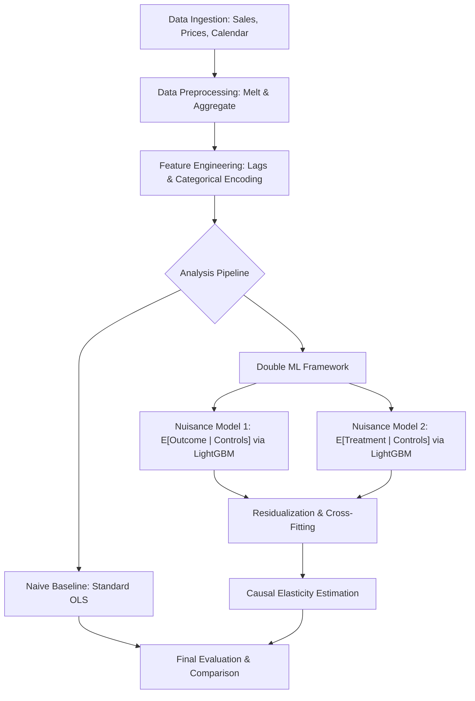

# Double Machine Learning for Demand Price Elasticity

This repository is intended to provide a baseline for hands-on practice with causal inference techniques, specifically focusing on estimating demand price elasticity using Double Machine Learning (DML). 

The project utilizes a structured pipeline to process M5 Walmart retail goods sales data (https://www.kaggle.com/competitions/m5-forecasting-accuracy/data), engineer relevant features, and apply the Partially Linear Regression (PLR) DML model to obtain unbiased estimates of price elasticity.

## Process Flow



## Project Overview

In retail analytics, estimating the effect of price on quantity sold is often confounded by seasonality, promotions, and historical trends. Standard OLS regressions often suffer from "omitted variable bias" or "overfitting" when dealing with high-dimensional controls.

## ML Model vs. OLS Discussion

### Ordinary Least Squares (OLS)
Traditional OLS serves as our naive baseline. While computationally efficient and interpretable, it assumes a strictly linear relationship between all variables. In retail data, price changes are often correlated with unobserved factors (like marketing campaigns) or non-linear seasonal trends. If these confounders are not perfectly captured and linearly specified, the OLS estimate of elasticity will be biased and potentially misleading.

### Double Machine Learning (DML) with LightGBM
This project uses **Double Machine Learning** to overcome the limitations of OLS. The core innovation is the use of high performance ML models, specifically **LightGBM** to handle the "nuisance" part of the estimation.

1.  **Flexibility**: LightGBM captures complex, non-linear interactions and dependencies between features (e.g., how the impact of a SNAP event changes depending on the month) that would be impossible to specify manually in a linear model.
2.  **Orthogonalization**: By using ML to predict both the quantity ($Y$) and the price ($T$) based on the controls, and then regressing the residuals, DML "partials out" the influence of confounders. This ensures that the final elasticity estimate is derived only from the variation in price that is *not* explained by other factors.
3.  **Cross-Fitting**: DML employs K-fold cross-fitting to remove bias introduced by overfitting the ML models, a common pitfall when using flexible learners for causal inference.

## Repository Structure

*   `main.py`: The entry point that orchestrates the data loading, feature engineering, and model training phases.
*   `data_preparation.py`: Handles the ingestion of sales, prices, and calendar data. It performs log-transformations and aggregates data to a weekly granularity.
*   `feature_engineering.py`: Creates lagged sales features (crucial for capturing demand momentum) and encodes categorical variables for the ML learners.
*   `model_training.py`: Defines the DoubleML data structure and executes the `DoubleMLPLR` using LightGBM as the nuisance learners.
*   `config.py`: A centralized configuration file for hyperparameters, column mappings, and file paths.
*   `evaluation.py`: (Utility) Contains functions to compare DML results against a baseline OLS model.

## Data Requirements

The pipeline expects three CSV files in a `data/` directory:
1.  `sales_train_evaluation.csv`: Unit sales per item/store.
2.  `sell_prices.csv`: Weekly prices per item/store.
3.  `calendar.csv`: Mapping dates to weeks, months, and event flags (e.g., SNAP, holidays).

## Getting Started

### 1. Prerequisites
Ensure you have Python 3.8+ installed. It is recommended to use a virtual environment:

```bash
python -m venv venv
source venv/bin/activate  # On Windows: venv\Scripts\activate
pip install pandas numpy doubleml lightgbm scikit-learn
```

### 2. Configuration
Modify `config.py` to change the target category (default: `FOODS`) or adjust the LightGBM hyperparameters to suit your dataset size.

### 3. Execution
Run the full pipeline with:

```bash
python3 main.py
```

## Technical Methodology

The pipeline implements the **Partially Linear Regression (PLR)** framework, which decomposes the relationship between price and demand into a linear causal component and a non-linear nuisance component:

1.  $Y = \theta D + g_0(X, W) + \zeta, \quad E[\zeta | D, X, W] = 0$
2.  $D = m_0(X, W) + \nu, \quad E[\nu | X, W] = 0$

### Methodology Components

*   **Residualization (Robinson's Transformation)**: Instead of regressing $Y$ on $D$ directly, we use LightGBM to estimate the conditional expectations $\hat{l}(X,W) = E[Y|X,W]$ and $\hat{m}(X,W) = E[D|X,W]$. We then compute the residuals: $\tilde{Y} = Y - \hat{l}$ and $\tilde{D} = D - \hat{m}$. The elasticity $\theta$ is estimated by regressing $\tilde{Y}$ on $\tilde{D}$. This "doubly robust" approach ensures that even if one nuisance model is slightly misspecified, the estimate remains consistent.
*   **Cross-Fitting (DML2)**: To prevent bias from over-fitting the nuisance models to the same data used for elasticity estimation, the repository uses $K$-fold cross-fitting. The nuisance models are trained on $K-1$ folds and used to generate residuals for the $K$-th fold.
*   **Variable Definitions**:
    *   **$Y$ (Outcome)**: `log_quantity`.
    *   **$D$ (Treatment)**: `log_price`.
    *   **$X, W$ (Confounders)**: High-dimensional controls including seasonality (month), store/dept IDs, and auto-regressive terms (`lag_sales`).

### Why Log-Log?
In this setup, the coefficient $\theta$ represents the **Constant Elasticity of Demand**:

$$\theta = \frac{\partial \log(Q)}{\partial \log(P)} = \frac{\partial Q / Q}{\partial P / P}$$

This means a 1% increase in price results in a $\theta$% change in quantity sold.

### Identifying Assumptions
For $\theta$ to have a causal interpretation, the model assumes **Conditional Independence** (Unconfoundedness): all variables that simultaneously affect price and demand (e.g., holidays, past sales momentum) are captured in $W$. By including `lag_sales_1` and `lag_sales_2`, we control for demand shocks that might have influenced pricing decisions.

## Key Features

*   **Automated Preprocessing**: Handles the "melt" and "merge" operations for complex relational retail data.
*   **High-Dimensional Control**: Uses LightGBM's gradient boosting to capture non-linearities in $g_0$ and $m_0$ that standard OLS would miss.
*   **Statistical Rigor**: Provides standard errors and confidence intervals that are valid even when using complex ML learners for the nuisance components.

## License
This project is licensed under the MIT License.